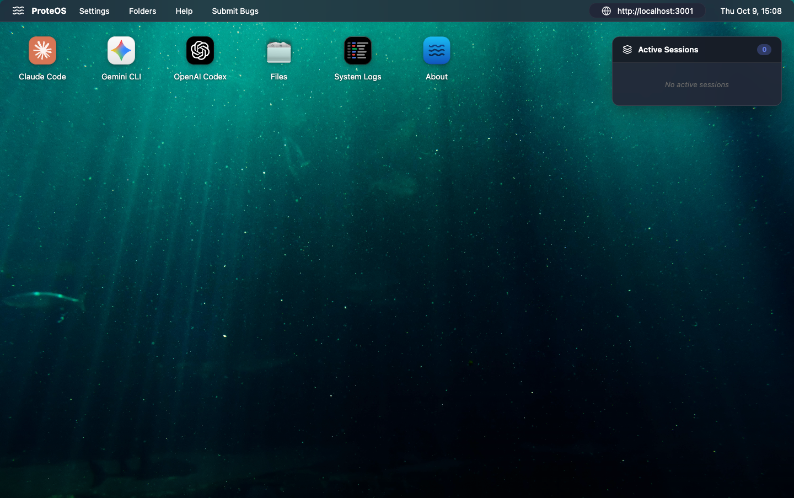
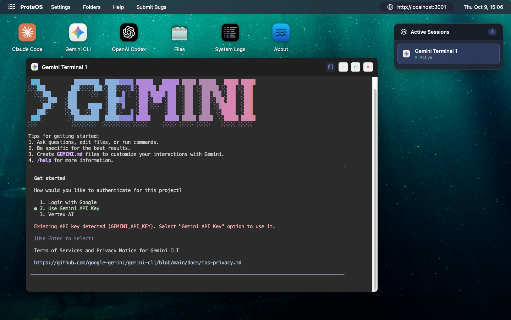

# 🌊 ProteOS (P/OS)

> *"Shape-shifting intelligence from the depths of containerization"*

**ProteOS** — derived from **Proteus (Πρωτεύς)**, the Greek sea god of shape-shifting, wisdom, and prophecy. Just as Proteus could transform into any form, ProteOS adapts seamlessly between multiple AI providers, embodying flexibility and intelligence while maintaining Docker's oceanic heritage.

   


*ProteOS ocean-themed desktop with multiple AI providers*


*Gemini CLI running in a dedicated terminal window*

## ✨ Features

### 🎭 Multi-AI Provider Support
- **🐋 Claude Code** (Anthropic Claude 3.5 Sonnet)
- **🔷 Gemini CLI** (Google Gemini 2.5 Pro)
- **⚡ OpenAI Codex** (OpenAI GPT-4/Codex)

### 🐳 Docker-Powered
- **Isolated Containers**: Each AI runs in its own environment
- **Resource Efficient**: Only active containers consume resources
- **Easy Scaling**: Spawn unlimited AI instances

### 📁 File System
- **Persistent Storage**: Each container gets its own workspace
- **File Browser**: View and manage files across all containers
- **Easy Access**: Files stored locally in `workspace/containers/`

### 📊 System Monitoring
- **Live System Logs**: Dedicated window showing real-time operations and events
- **Log Filtering**: Filter logs by level (Info, Success, Warning, Error)
- **Auto-Scroll**: Optional automatic scrolling to latest log entries
- **Debug Visibility**: Track container creation, connections, and failures instantly

### 🌐 Web-Based
- **No Installation**: Access from any browser
- **Remote Access**: Run on server, access from anywhere
- **Cross-Platform**: Works on Mac, Linux, Windows


## 🚀 Quick Start

### Using Docker Compose (Recommended)

```bash
# 1. Clone the repository
git clone <your-repo-url>
cd ProteOS

# 2. Configure API keys
cp .env.example .env
nano .env  # Add your API keys

# 3. Build and start ProteOS
docker compose up --build

# 4. Open your browser
open http://localhost:3001
```

**Note**: ProteOS runs on port **3001** by default to avoid conflicts with other services.

## 🔑 API Keys

ProteOS supports three AI providers. Configure the ones you want to use:

```env
# Claude Code (Anthropic)
ANTHROPIC_API_KEY=your-claude-key
# Get from: https://console.anthropic.com/

# Gemini CLI (Google)
GEMINI_API_KEY=your-gemini-key
# Get from: https://aistudio.google.com/apikey

# OpenAI Codex
OPENAI_API_KEY=your-openai-key
# Get from: https://platform.openai.com/api-keys

# Server configuration
PORT=3000
```


## 📜 LOLcense

For {root} sake I'm a designer. Mostly all the code has been writen by chatGPT and *ad latere*.

## 🙏 Credits

**ProteOS** is built with:

- [Claude Code](https://claude.com/claude-code) by Anthropic
- [Gemini CLI](https://github.com/google-gemini/gemini-cli) by Google
- [OpenAI Codex](https://github.com/openai/codex) by OpenAI
- [ttyd](https://github.com/tsl0922/ttyd) for web terminals
- [Docker](https://docker.com) for containerization
- [Express](https://expressjs.com) for the server
- [Lucide](https://lucide.dev) for beautiful SVG icons

---

## LOLcense

For {root} sake I'm a designer. Mostly all the code has been written by Claude and ad latere.
